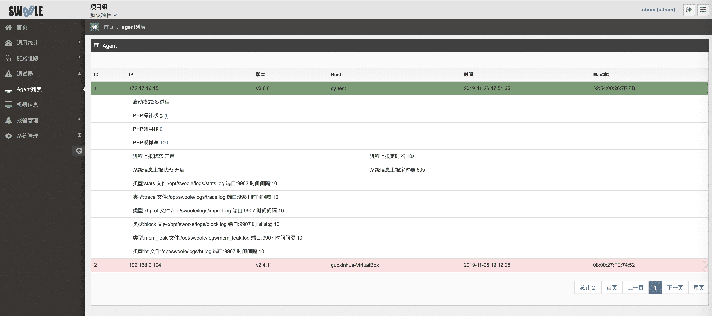
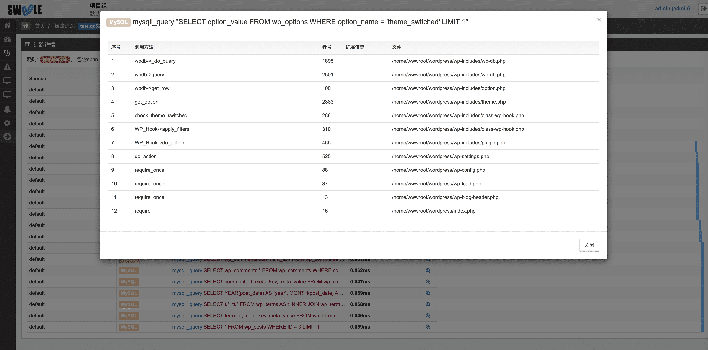

在线控制 Agent 的部分功能，如修改探针状态、修改采样率、修改获取调用栈以及对应的客户端信息、状态等

## 探针状态
远程开启关闭探针，`1`表示开启，`0`表示关闭

## 调用栈
链路追踪中的 trace 信息增加了一个调用栈，会展示该请求中抓取到的相关操作的调用方法、行号、扩展信息、文件，如下图

可以进行开启或关闭，修改对应调用栈深度，`0`表示关闭

## 采样率
远程动态修改采样率。采样率只作用于应用追踪，设置为`100`则表示每次请求都会生成一条 trace 数据