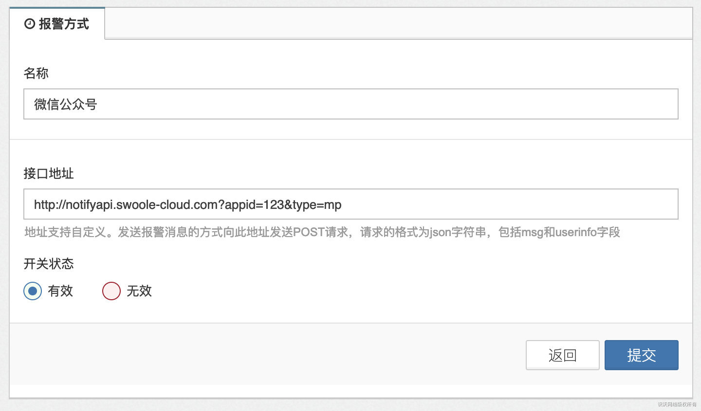
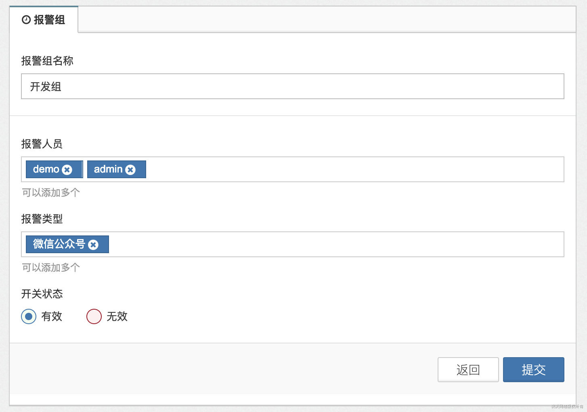
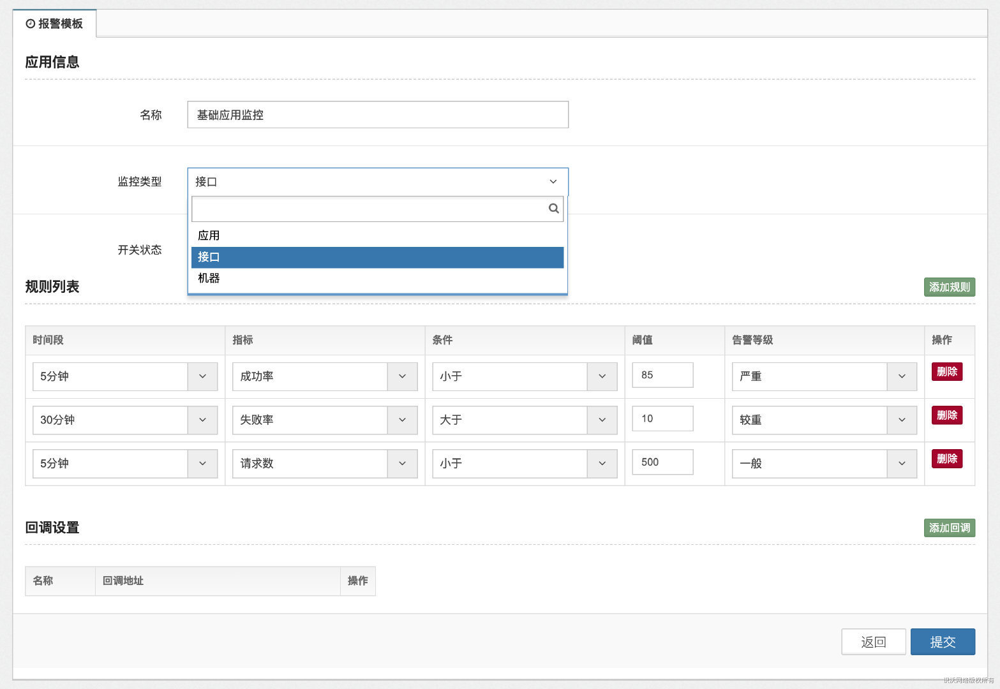
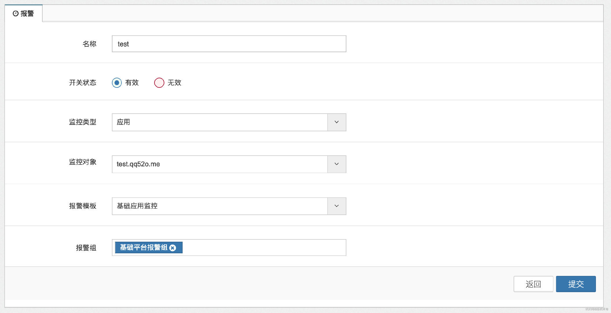

[TOC]

报警是监控系统的重要组成部分，通过对系统的运行情况设置阈值，例如成功率，失败率，请求数等，当达到阈值时，可以及时获得通知。本系统提供了灵活和完善报警功能，支持短信，企业微信，微信公众号，邮件等多种报警消息通知方式，既可以使用系统提供的服务进行接收报警消息，也通过自定义http接口来接收报警消息。

## 报警方式

本系统报警目前支持微信公众号、企业微信、钉钉群、短信通知

>[success] 默认使用我司微信公众号推送，需要关注`SwooleService`公众号获取用户`id`
> 
> 关注后会收到如：您好！欢迎关注`SwooleService`服务号。 您的用户id: `FQY4Vansnxegm0G7t3RVgbn+ID33j/8ysnGso+gJqG0=`
> 在后台处填写此`id`可用于监控报警等功能

* 添加报警方式

填写对应的名称，以及接口地址

>[info] http://notifyapi.swoole-cloud.com?appid=123&type=mp 此地址为我司默认推送地址



可自定义推送地址，发送报警消息的方式为向此地址发送`POST`请求，请求的格式为`json`字符串，包括`msg`和`userinfo`字段，可自行处理报警信息

`json`格式如下：

```json
{
    "msg":
    {
        "level":2,
        "alert_id":"409",
        "obj_type":"1",
        "obj_id":"1000402",
        "obj_name":"User应用",
        "alert_event":"[{\"time\":6,\"index\":\"total_count\",\"condition\":\"lt\",\"value\":5000,\"level\":2}]",
        "msg":"[2018-11-29] \u544a\u8b66\u7b49\u7ea7:\u8f83\u91cd, \u5e94\u7528User, 11:20-11:50\u65f6\u95f4\u6bb5\u768430\u5206\u949f\u5185, \u8bf7\u6c42\u6570  < 5000;\u8bf7\u5c3d\u5feb\u5904\u7406\u3002"
    },
    "userinfo":
    {
        "94":{
            "id":"94",
            "uid":"0",
            "email":"",
            "mp_openid":"",
            "project_id":"",
            "mobile":"",
            "gid":"0",
            "usertype":"0",
            "username":"admin",
            "weixinid":"",
            "dingdingid":""
            }
    }
}
```

* 删除报警方式

无需删除，将此方式设置为无效即可

## 报警组

报警组为设置需要给`那些人员`通过`哪种方式`推送报警消息



报警人员可设置多个，用户从用户列表中获取
报警类型也可设置多个，报警类型为上方添加的报警方式

## 报警模板

报警模板是来设置报警规则的，支持监控应用、接口、以及客户端机器



* 应用&接口

应用和接口支持设置成功率、失败率、响应时间、请求数，可同时配置多条规则

* 机器

目前机器监控支持`CPU`使用率、可用内存剩余率、磁盘容量

## 报警列表

报警列表为最终的报警设置，选择需要监控的类型（应用、接口、机器），选择后再选择对应的监控对象，选择对应的报警模板，报警组即可

