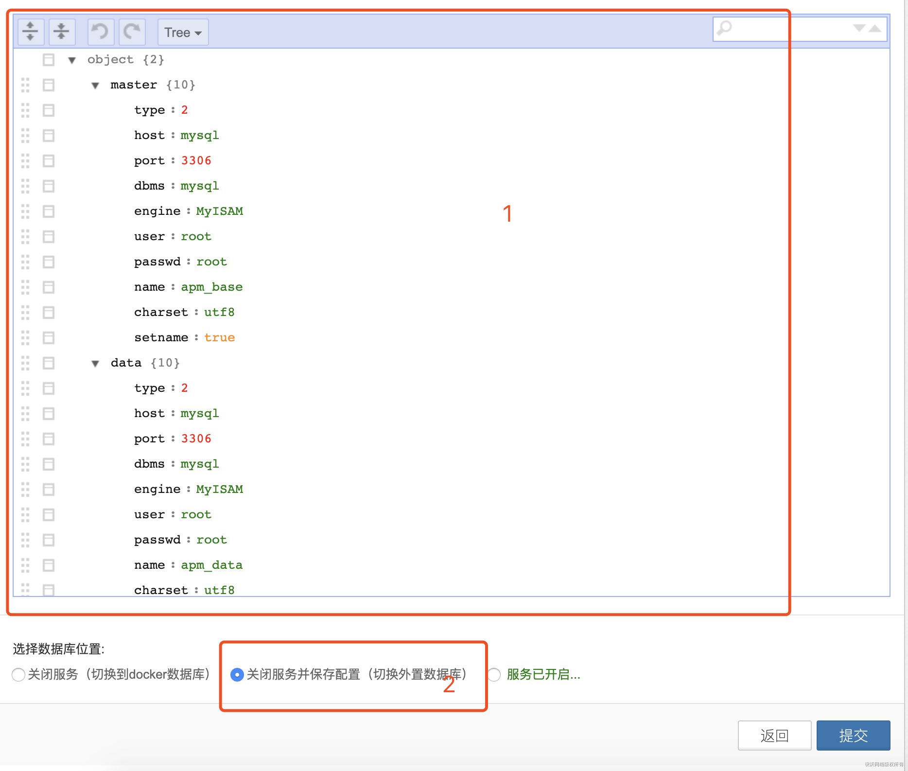
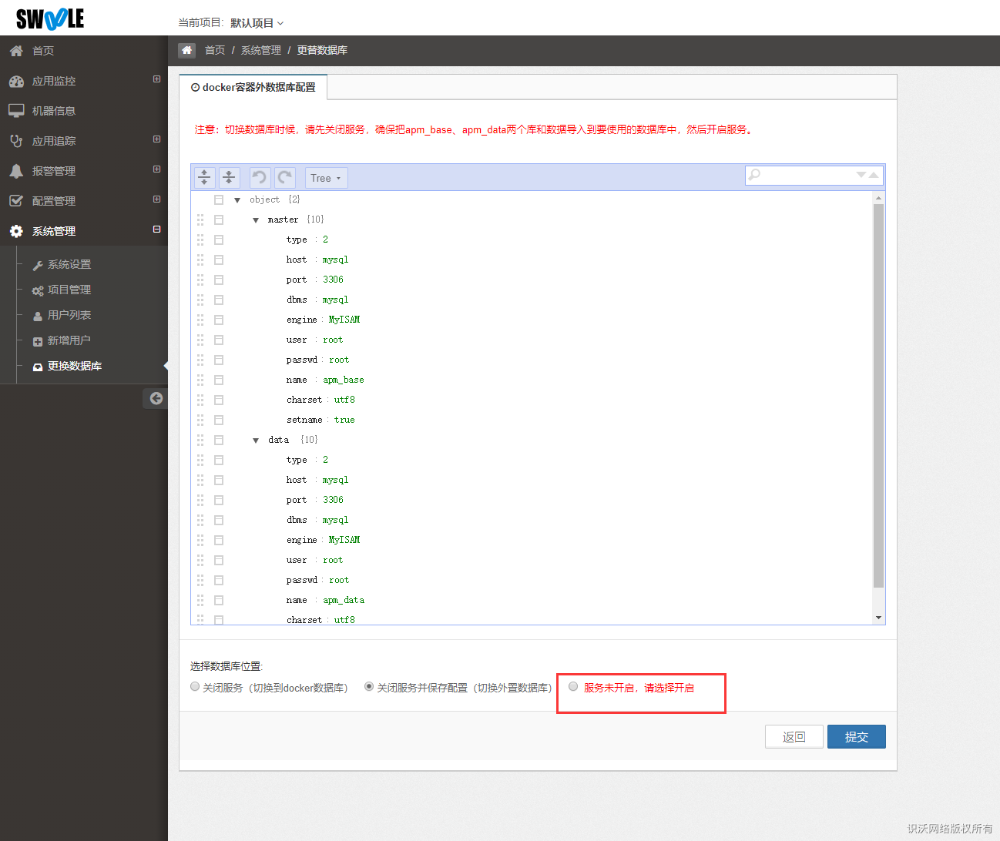

我们提供以下两种修改方式

[TOC]

## 安装前修改

安装前可修改MySQL和Redis存储配置，修改方式如下：

1. 更换MySQL数据库，需要将`swoole-admin/sql/apm_base.sql`文件中的SQL进行导入到新的数据库中，用来创建数据库和表。

>[info] 因为`apps`和`common`目录的配置文件都是加密的，所以请先修改`docker`目录下的配置文件，然后复制到对应目录。

2. 修改`apps`目录的配置
```bash
cp docker/swoole-admin-apps-conf/db.php swoole-admin/center/web/apps/configs/product/db.php
```
3. 修改`common`目录的配置
```bash
cp docker/swoole-admin-common-conf/*  swoole-admin/center/common/configs/product
```

## 安装后修改

>[danger] 安装后在线修改只能修改MySQL部分，未提供修改Redis功能。

后台提供了在线切换MySQL数据库的功能，如需更换到自己的数据库请按如下操作

- 将自己数据库配置填写进红框1
- 选择红框2并点击提交，将会检测数据库是否可以连接，如果可以则会关闭服务
- 刷新页面后会显示如图2的服务未开启
- 按照红色字的提示，将docker内的数据库数据原封不动拷贝到自己的数据库（如果没有新数据，则可以拷贝初始化SQL文件：`swoole-admin/sql/apm_base.sql`）
- 拷贝好以后选择第三个选项服务未开启，请选择开启的选项，并点击提交
- 如需需要更换为docker内的数据库，则同上操作选择第一个选项在操作一次




