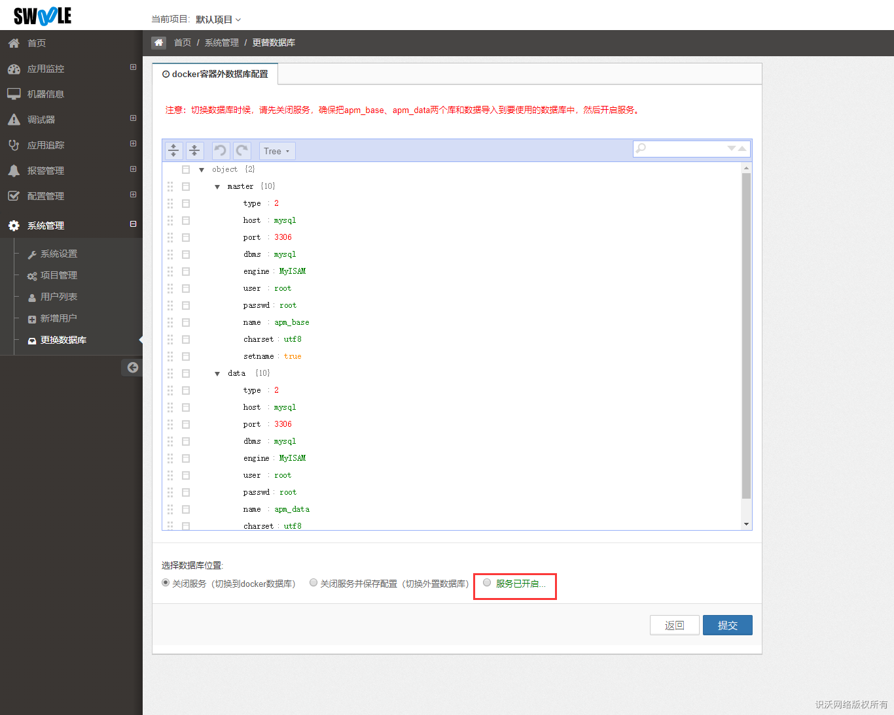

## 此处显示当前服务开启状态

## 如需更换到自己的数据库请按如下操作

- 将自己数据库配置填写进红框1
- 选择红框2并点击提交，将会检测数据库是否可以连接，如果可以则会关闭服务
- 刷新页面后会显示如图2的服务未开启
- 按照红色字的提示，将docker内的数据库数据原封不动拷贝到自己的数据库
- 拷贝好以后选择第三个选项服务未开启，请选择开启的选项，并点击提交
- 如需需要更换为docker内的数据库，则同上操作选择第一个选项在操作一次

