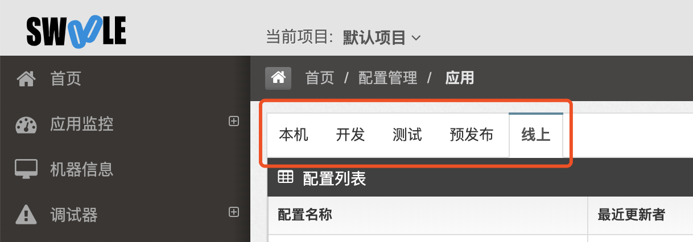

# 配置管理(上报规则管理)

## 原因

我们的无侵入式监控是通过拦截系统关键调用（例如 `mysqlil` 的 `query` ）来做到的，如果你的代码里面调用了 `mysql->query` 我们就会拦截到，并将耗时、成功失败等上报到后台。

但是这样会有一个问题就是我们`不知道具体那行业务代码调用了query方法`，`也不知道具体那个类和函数调用了query方法`，只知道有 `query` 调用，所以我们需要上报规则配置。

## 配置示例

例如上报规则配置文件的内容是

```json
{
    "show_line": 0,
    "whitelist": [
        "App",
        "Controller",
        "Model"
    ]
}
```

项目中 `App/Controller/TestController.php` 文件中调用 `\App\Test::a()` 方法， `a()` 方法中经过 `db` 层框架调用了 `query` 方法，这时候我们就会自动分析业务调用栈，生成例如 `\App\Test::a:mysqli:qeury` 的接口名称，同时支持是否显示行号。

>[danger] whitelist配置的大小写敏感！！！

>[info] 配置为框架对应的文件目录名称，即框架中的App目录、Controller目录、Model目录；
> 上层优先级高，即Controller和Model在App目录下，在App下匹配到Controller和Model后就不再匹配下面的Controller和Model。

如果没有配置规则，则不会分析请求路径生成业务逻辑关联的接口信息，只会生成类似`mysqli->query`这样的上报数据。

修改配置后需要重启客户端fpm进程，修改配置时需要注意对应的环境。

