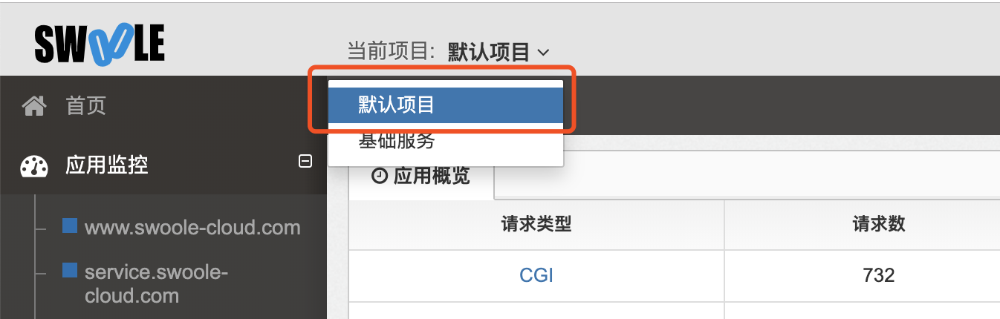

# 上报监控数据

[TOC]

>[success] 上报成功后在后台查看，需要切换当前项目，默认在默认项目中。

>[danger] 可以先看应用追踪，首页和应用监控需要时间进行分析。


## FPM应用

### 自动创建应用

默认客户端会自动上报，服务端自动生成对应的应用，并上报监控数据。如果在后台关闭了自动创建应用，则需要手动创建应用。

### 手动创建应用

在服务端->系统管理->相应项目->应用管理->新增应用 应用名即为您要监控站点的域名，如有端口请加上端口。

>[info] 例如：您想监控的站点域名为www.test.com，服务名则填www.test.com（注意：域名若带端口，服务名也要带端口）

配置完成后，稍等片刻即可查看对应的监控数据

## Service应用

>[success] 在`cli`模式下执行的应用，比如`swoole`的常驻进程服务。 v2.4.4以后版本支持**自动创建应用**，可以不手动创建应用

### 手动创建应用

在服务端->系统管理->相应项目->应用管理->新增应用 应用名即为您要监控的服务名。

>[info] 例如：您想监控服务名为`user_service`的cli常驻进程应用，您的应用类型选择Service，服务名填`user_service`.

### Service上报指南
#### 自动创建

系统支持自动生成应用名称并创建应用，无需修改任何代码，生成的应用名称格式为：
Swoole的HttpServer：`ip:prot`
其他的Server：`ip(hostname):prot`

#### 手动埋点
如果需要自定义应用名称的话，需要在适当位置用下面的方法手动添加埋点代码：

```php
/**
 * 请求服务前执行
 * @param  $func eg.  App\Login\Weibo::login'
 * @param  $serviceName 必须和创建应用时候服务名一致 eg. 'user'
 * @param  $serverIp eg. '192.1.1.1'
 * @return StatsCenter_Tick object
 */
$tick = \SwooleTracker\Stats::beforeReqRpc($func, $serviceName, $serverIp);
  
/*
 * 请求服务后执行
 * @param $tick  StatsCenter_Tick object
 * @param $ret   true/false
 * @param $errno 201
 * @return void
 */
\SwooleTracker\Stats::afterReqRpc($tick, $ret, $errno);

 /**
 * 被调用开始前执行
 * @param  $func eg.  App\Login\Weibo::login'
 * @param  $serviceName 必须和创建应用时候服务名一致 eg. 'user'
 * @param  $serverIp eg. '192.1.1.1'
 * @return StatsCenter_Tick object
 */
$tick = \SwooleTracker\Stats::beforeExecRpc($func, $serviceName, $serverIp);

/*
 * 被调用结束后执行
 * @param $tick  StatsCenter_Tick object
 * @param $ret   true/false
 * @param $errno 201
 * @return void
 */
\SwooleTracker\Stats::afterExecRpc($tick, $ret, $errno);
```

### 实例说明

`A`请求或调用`B`时，在`A`请求服务`B`的代码前在加上`beforeReqRpc()`方法，结束时加上`afterReqRpc()`方法，此时后台可以统计到`A`调`B`的`这次`调用的成功、失败、耗时等信息，这组函数是站在调用端的角度的。

微服务框架一般都有统一的服务入口，在`B`的服务入口处(开始)加上`beforeExecRpc()`方法，服务出口处(结束)加上`afterExecRpc()`方法。此时后台可以统计到`B`被调用的所有链路信息，例如这次调用的 `mysql` `redis` 等调用都会在`afterExecRpc()`后上报，这组函数是站在被调用端角度的。

### 透传TraceId/SpanId

```php
/**
 * 被调用开始前执行
 * @param  $func eg.  App\Login\Weibo::login'
 * @param  $serviceName 必须和创建应用时候服务名一致 eg. 'user'
 * @param  $serverIp eg. '192.1.1.1'
 * @param string $traceId
 * @param string $spanId
 * @return StatsCenter_Tick object
 */
$tick = \SwooleTracker\Stats::beforeExecRpc($func, $serviceName, $serverIp, $traceId, $spanId);

/**
 * 被调用结束后执行
 * @param $tick  StatsCenter_Tick object
 * @param $ret   true/false
 * @param $errno 201
 * @return void
 */
\SwooleTracker\Stats::afterExecRpc($tick, $ret, $errno);
```