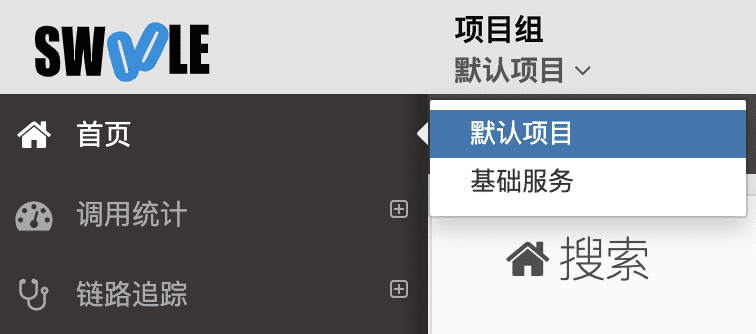

[TOC]

>[success] 上报成功后在后台查看，需要切换当前项目，默认在默认项目中。



>[danger] 可以先查看链路追踪，首页和调用统计需要时间进行分析。

## FPM应用

### 自动创建应用

默认客户端会自动上报，服务端自动生成对应的应用，并上报监控数据。如果在后台关闭了自动创建应用，则需要手动创建应用。

### 手动创建应用

在服务端->系统管理->相应项目->应用管理->新增应用 应用名即为您要监控站点的域名，如有端口请加上端口。

>[info] 例如：您想监控的站点域名为`www.test.com`，服务名则填`www.test.com`（注意：域名若带端口，服务名也要带端口）

配置完成后，稍等片刻即可查看对应的监控数据

## Service应用

>[success] 在`cli`模式下执行的应用，比如`swoole`的常驻进程服务。

### 自动创建应用

系统支持自动生成应用名称并创建应用，无需修改任何代码。

如果使用 `Swoole` 的 `HttpServer` 那么生成的应用名称为`ip:port`

如果使用 `Swoole` 其他的 `Server` 那么生成的应用名称为`ip(hostname):port`

### 手动创建应用

在服务端->系统管理->相应项目->应用管理->新增应用 应用名即为您要监控的服务名。

>[info] 例如：您想监控服务名为`user_service`的cli常驻进程应用，您的应用类型选择Service，服务名填`user_service`.

### Service上报指南

>[danger] 暂不支持多端口监听。

#### 自动上报

系统支持自动生成应用名称并创建应用，无需修改任何代码

#### 手动埋点

如果需要自定义应用名称的话，需要在适当位置用下面的方法手动添加埋点代码：

```php
 /**
 * 被调用开始前执行
 * @param  $func eg.  'App\Login\Weibo::login'
 * @param  $serviceName 必须和创建应用时候服务名一致 eg. 'user'
 * @param  $serverIp eg. '192.1.1.1'
 * @return StatsCenter_Tick object
 */
$tick = \SwooleTracker\Stats::beforeExecRpc($func, $serviceName, $serverIp);

/*
 * 被调用结束后执行
 * @param $tick  StatsCenter_Tick object
 * @param $ret   true/false
 * @param $errno 201
 * @return void
 */
\SwooleTracker\Stats::afterExecRpc($tick, $ret, $errno);
```

### 实例说明

微服务框架一般都有统一的服务入口，在`B`的服务入口处(开始)加上`beforeExecRpc()`方法，服务出口处(结束)加上`afterExecRpc()`方法。此时后台可以统计到`B`被调用的所有链路信息，例如这次调用的 `mysql` `redis` 等调用都会在`afterExecRpc()`后上报，这组函数是站在被调用端角度的。

### 透传TraceId/SpanId

```php
/**
 * 被调用开始前执行
 * @param $func eg.  'App\Login\Weibo::login'
 * @param $serviceName 必须和创建应用时候服务名一致 eg. 'user'
 * @param $serverIp eg. '192.1.1.1'
 * @param string $traceId
 * @param string $spanId
 * @return SwooleTracker\Tick object
 */
$tick = \SwooleTracker\Stats::beforeExecRpc($func, $serviceName, $serverIp, $traceId = "", $spanId = "");

/**
 * 被调用结束后执行
 * @param $tick SwooleTracker\Tick object
 * @param $ret true/false
 * @param $errno 201
 * @return void
 */
\SwooleTracker\Stats::afterExecRpc($tick, $ret, $errno);
```

>[danger] 如果需要透传并且调用端使用`Swoole\Coroutine\Http\Client`进行调用，则需要修改调用端代码，调用扩展提供的两个方法，同时增加两个`header`，如：

```php
$client->setHeaders(array_merge(
    [
        'x-swoole-traceid' => getSwooleTrackerTraceId(),
        'x-swoole-spanid' => genSwooleTrackerSpanId(),
    ],
    $client->requestHeaders
));
```

#### RPC

需要关联RPC链路追踪时，服务端和客户端都需要进行手动埋点。

服务端的埋点方法同上文，客户端需要在调用时添加埋点，代码如下

```php
/**
 * 客户端调用开始前执行
 * @param $func eg.  'App\Login\Weibo::login'
 * @param $serviceName 必须和创建应用时候服务名一致 eg. 'user'
 * @param $serverIp eg. '192.1.1.1'
 * @return SwooleTracker\Tick object
 */
$tick = \SwooleTracker\Stats::beforeReqRpc($func, $serviceName, $serverIp);

/**
 * 客户端调用结束后执行
 * @param $tick SwooleTracker\Tick object
 * @param $ret true/false
 * @param $errno 201
 * @return void
 */
\SwooleTracker\Stats::afterReqRpc($tick, $ret, $errno);
```