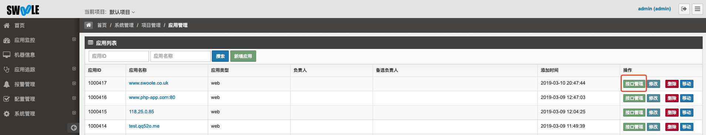
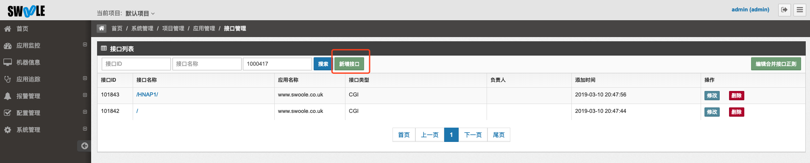
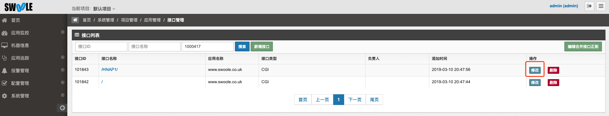
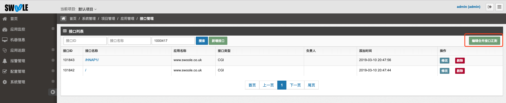
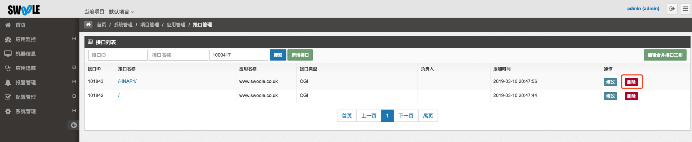

# 接口管理
[TOC]
## 新增接口

系统管理->项目管理->应用管理->接口管理->新增接口



## 修改接口

系统管理->项目管理->应用管理->接口管理->修改按钮


## 合并接口

系统管理->项目管理->应用管理->接口管理->编辑合并接口正则


- 注意:'/'前请用'\\'转义,例如：

```json
{
    "/正则/":"接口名",
    "/\\/sysinfo\\/index\\/*/": "/sysinfo/index/",
    "/\\/alert_group\\/lists\\/*/": "/alert_group/lists/"
}
```

- 如存在类似于/userinfo/1,/userinfo/2的只是参数id不同的接口则会自动合并成/userinfo/$，其中$为参数id的占位符

## 删除接口

系统管理->项目管理->应用管理->接口管理->删除按钮

