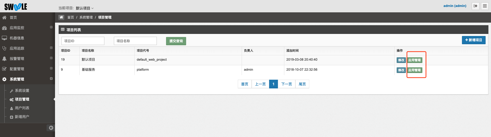
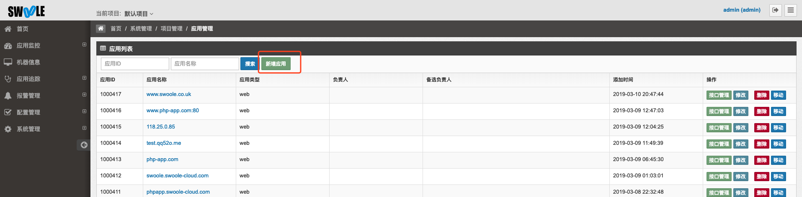
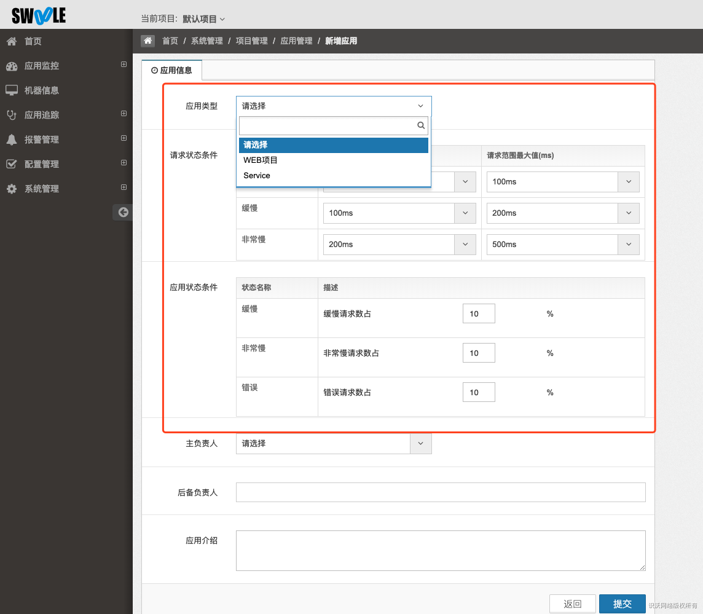
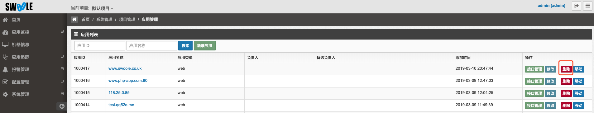
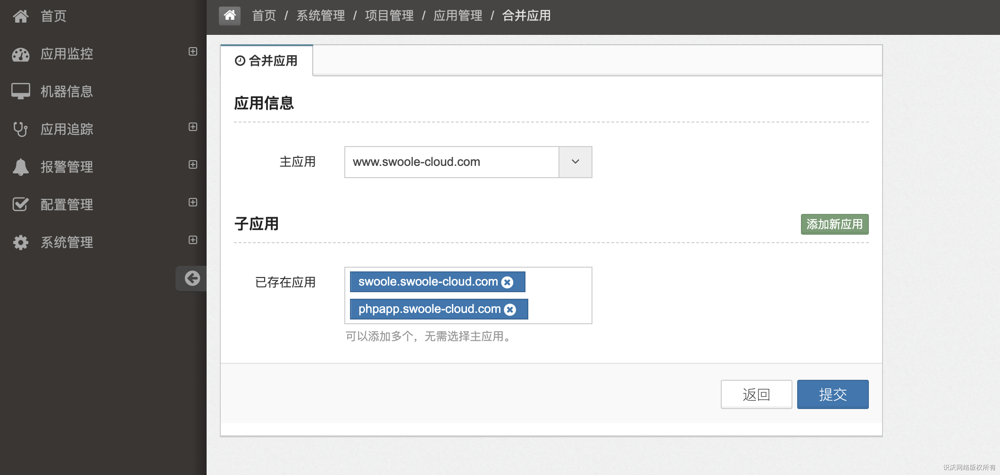

# 应用管理
[TOC]
## 新增应用

* 系统管理->项目管理->应用管理->新增应用

- 应用类型支持`Web`和`Service`

> Service应用为常驻进程类的应用。

- 请求状态条件和应用状态条件为首页(应用面板)服务状态的监控阈值，可根据实际需求配置。
- 服务端和客户端部署完成后，默认会自动创建web应用到默认项目中。

## 修改应用

* 系统管理->项目管理->应用管理->修改按钮

### 别名

可自定义别名，别名在左侧菜单栏中优先显示。

## 删除应用

* 系统管理->项目管理->应用管理->删除按钮

## 合并应用

合并相同功能的应用，比如`www`和不带`www`的内容相同，并未`301`重定向时可进行合并，展示在一起。

系统管理->项目管理->应用管理->合并应用

### 新增合并

系统管理->项目管理->应用管理->合并应用->增加合并

## 应用黑名单

添加进应用黑名单的 `Web` 应用不会自动创建，如果需要请先自动创建应用后，选择加入黑名单后，删除该应用即可。

系统管理->项目管理->应用管理->合并黑名单->新增黑名单

## 移动应用

新增移动多个应用，可以同时移动多个应用到其他项目中

系统管理->项目管理->应用管理->移动应用

