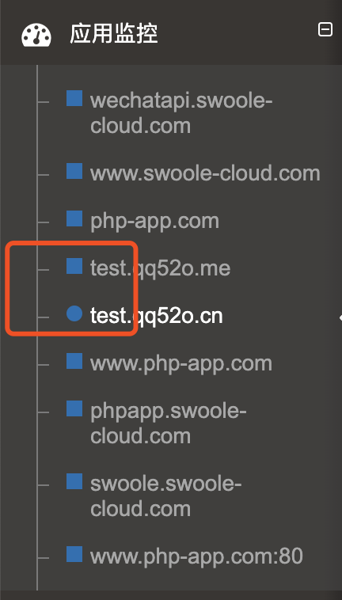
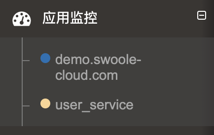

# 名词解释

[TOC]

## 项目

在整个系统中，可以分为多个项目，比如默认项目、基础项目等等，用来区分不同类型，不同层次的项目。

系统中的默认项目为所有自动创建的 `Web` 应用都会默认在此项目中，可以移动到其他项目中。

## 应用

应用分为两种类型，一种 `Web`应用， 一种 `Service`应用。

### 应用图标说明

正方形表示自动创建应用
圆形表示手动添加应用

蓝色(#1F6FB5)表示 `WEB` 应用
橙黄色(#FCD692)表示 `Service` 应用

## 主调、被调

主调与被调是主动与被动的关系。

现在有A、B两个函数，A函数调用了B函数，那么，A函数就是主调函数，B函数就是被调函数。

主调明细和被调明细也是如此，谁主动调用，谁被调用。

这和现实生活中的打电话是一样的，一个是主叫，一个是被叫。