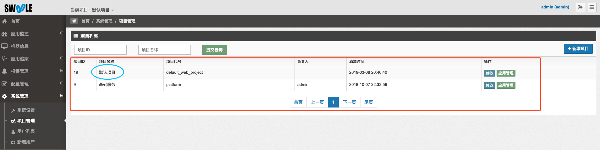
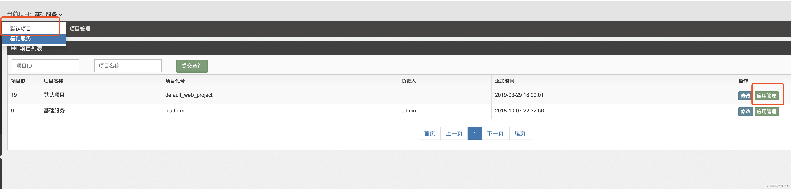
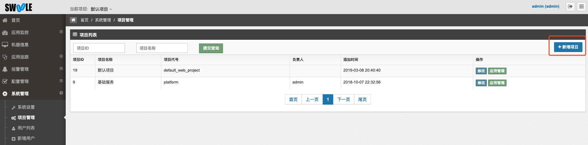
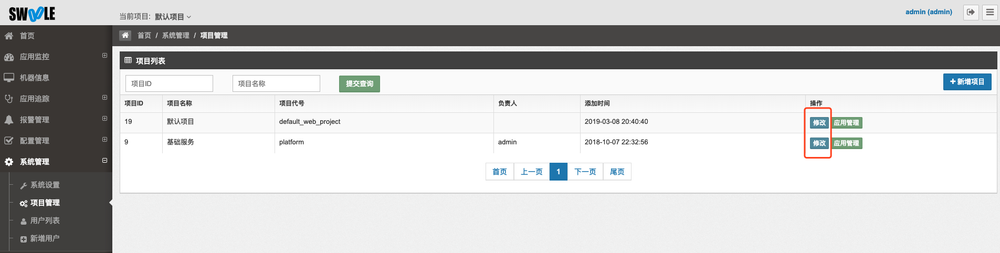

[TOC]
## 项目列表

* 系统管理->项目管理

- 服务端和客户端部署完成之后会自动创建一个名为`默认项目`的项目

## 切换项目

1. 点击应用管理，如果点击的项目和当前项目(左上角显示的项目)不一致，将会自动切换点击的项目
2. 点击左上角显示的项目进行切换

## 新增项目

* 系统管理->项目管理->新增项目按钮

## 修改项目

* 系统管理->项目管理->修改按钮

## 删除项目

- 暂不支持删除