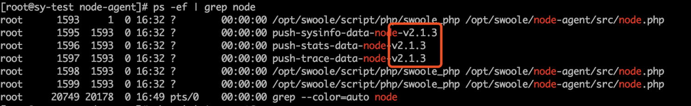
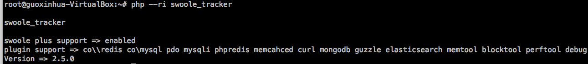
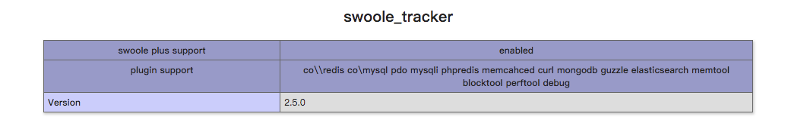
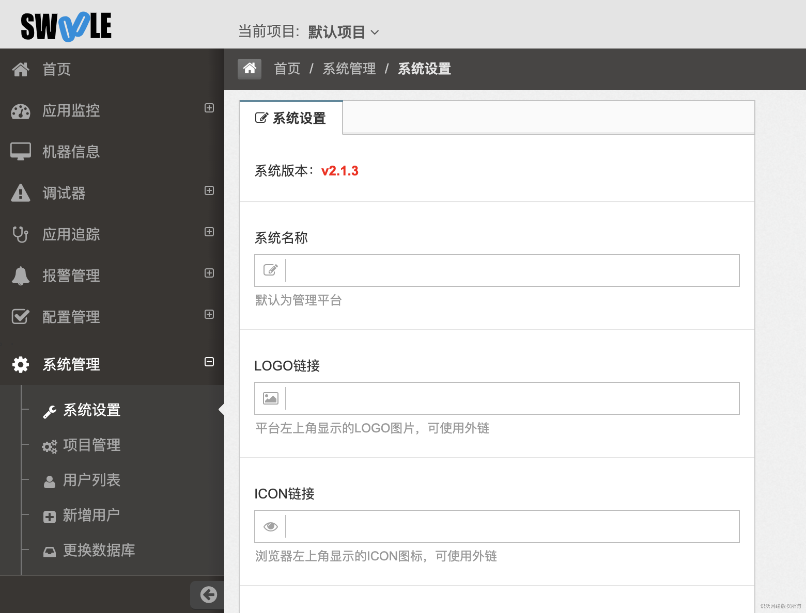
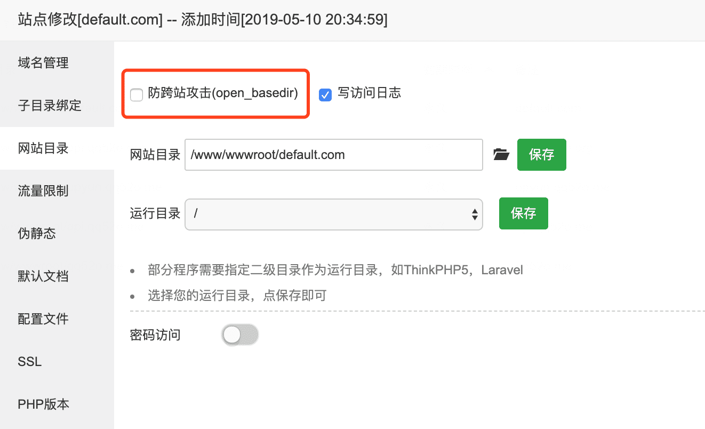
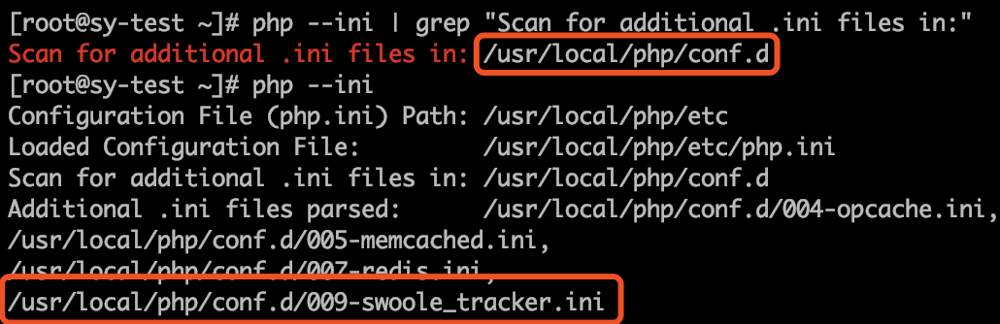
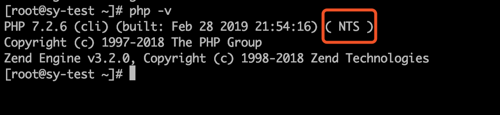

# 常见问题

[TOC]

一切问题先检查客户端、`swoole_tracker`扩展、服务端版本是否一致，是否为最新发布版本

>[success] swoole_tracker扩展的发布版本可能会出现比客户端、服务端高，这个不影响。

* 查看客户端版本 `ps -ef | grep node`



* 查看 `swoole_tracker` 扩展版本

```ini
# php.ini不要忘了添加
extension=swoole_tracker.so
apm.enable=1
apm.sampling_rate=100
```

>[info] cli模式 php --ri swoole_tracker


>[success] fpm模式 phpinfo()


* 查看服务端版本



## 1. 找不到对应应用

* 查看项目是否正确，自动创建的应用会放到默认项目中
* 检查该应用是否存在合并应用或应用黑名单中
* 检查客户端`swoole_tracker` 配置是否正确，参考安装说明->客户端
* 检查客户端是否给该服务端上报

## 2. 应用监控/应用追踪无信息

* 检查对应后台地址(IP或域名)是否正确，防火墙、安全组中端口是否开放
>[danger] 端口在配置文件`/opt/swoole/config/config_port.conf`中
* 检查客户端进程是否存在
* 检查客户端`swoole_tracker`配置是否正确，参考安装说明->客户端
* 存在脏数据缓存，等待5-10分钟（之前逻辑为客户端上报的时候会创建文件缓存，每五分钟删除一次，重新安装服务端后客户端文件缓存未删除，出现脏数据缓存，导致短时间内无法上报，现已将缓存写入内存中，重装服务端后重启服务端fpm和重启swoole-admin服务就能正常接收数据，无需等待）

## 3. Service应用无应用监控、追踪信息

* 检查服务名是否存在于服务端
* 检查代码使用是否正确，参考安装说明->上报监控数据
* 检查客户端服务名和服务端创建是否一致
* 同问题2

## 4. 管理NodeAgent守护进程

目前NodeAgent采用系统的守护进程管理，如果要管理NodeAgent的状态：

* 对于采用openrc和类似sysvinit的系统（如Debian 7 "Wheezy", Ubuntu 14.04 "Trusty"（默认不安装systemd）, CentOS(RHEL) 6, Fedora 14, Gentoo（可选）, Archlinux（可选）, Alpine Linux）使用命令

```bash
/etc/init.d/node-agent start
/etc/init.d/node-agent stop
/etc/init.d/node-agent restart
```

来启动/停止/重启NodeAgent（非root用户需要sudo）

* 对于采用systemd的系统（Debian 8 "Jessie"及以后, Ubuntu 15.04 "Vivid"及以后, CentOS(RHEL) 7及以后, Fedora 15及以后, Gentoo（可选）, Archlinux（可选））使用命令

```bash
systemctl start node-agent
systemctl stop node-agent
systemctl restart node-agent
```

来启动/停止/重启NodeAgent（非root用户需要sudo）

## 5. 客户端报错： `Warning: require(): open_basedir restriction in effect.`

解决方法：检查客户端防跨目录设置 `open_basedir` 。

>[warning] 如果使用的是 `lnmp` 一键安装包，并且版本大于 `1.4` 可以直接使用 `lnmp` 安装包 `tools/` 目录下的 `./remove_open_basedir_restriction.sh` 进行移除，其他版本[查看lnmp官方文档](https://lnmp.org/faq/lnmp-vhost-add-howto.html#user.ini)说明处理

>[danger] 如果使用的是宝塔集成环境，当你新增网站或修改网站配置时会自动开启防跨站攻击(open_basedir)，需要进行关闭


## 6. 增加调试器中的相关代码后报错： `Fatal error: Uncaught Exception: plz set apm.enable_memcheck=1 which in php.ini`

解决方法：在 `php.ini` 中添加配置： `apm.enable_memcheck=1`

>[info] 从2.3.3版本以后默认关闭调试功能，需要手动进行配置。或者使用远程调试

## 7. 重装服务端并清空数据库后，没有上报信息等情况

从2.3.3版本开始有部分信息缓存在php内存中，服务端重装后，数据对应不上导致部分数据获取失败，所以客户端需要重启fpm进程

## 8. 机器信息无上报信息

1. 检查网络是否通畅
2. 查看客户端日志 `/opt/swoole/logs/NodeAgent-sysinfoerr.log` 是否存在，存在查看内容，是否有上报失败字样
3. 服务端地址是否正确

## 9. 进程列表无信息

1. 查看客户端node-agent进程是否存在
2. 查看客户端本地是否有pid文件，路径：`/var/run/swoole_tracker/`下的cli和fpm文件夹中
3. pid文件对应的进程是否正常

## 10. 加载扩展后报错`undefined symbol: php_pdo_get_exception`

扩展需要放在pdo扩展后面加载。使用`php --ini | grep "Scan for additional .ini files in:"`查看第三方加载目录，在此目录中创建一个`swoole_tracker`的配置



## 11. 加载扩展后报错`undefined symbol: compiler_globals in Unknown`

扩展支持`nts`非线程安全版本PHP，可使用命令`php -v`查看
