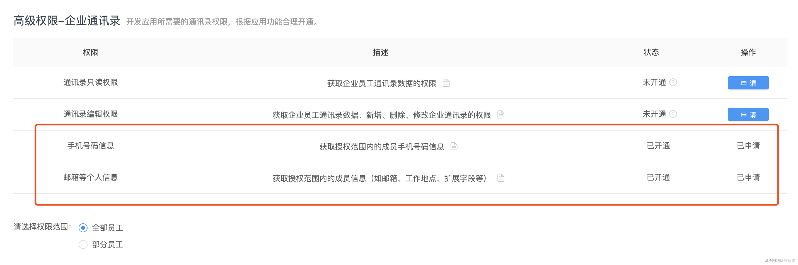
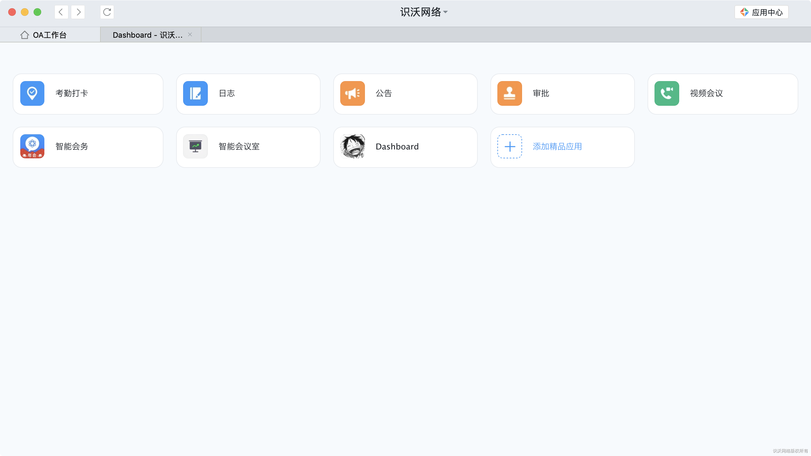
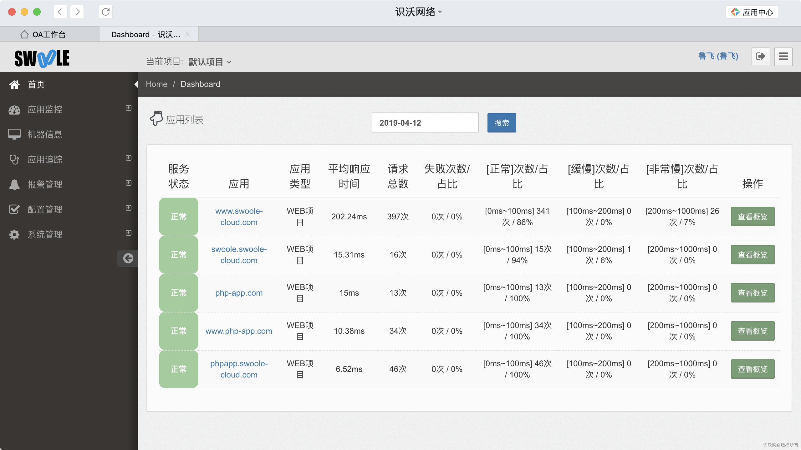
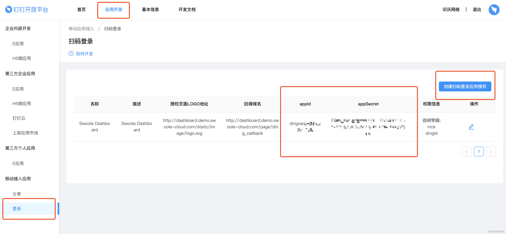
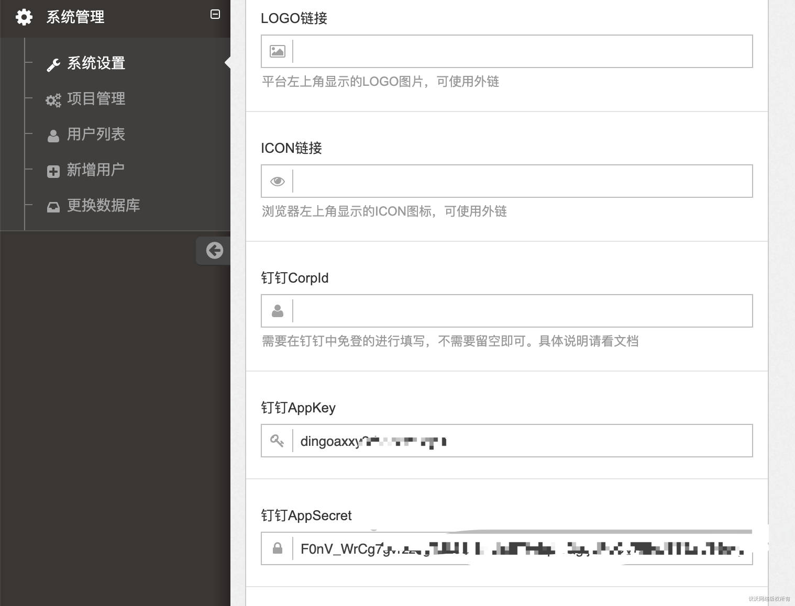
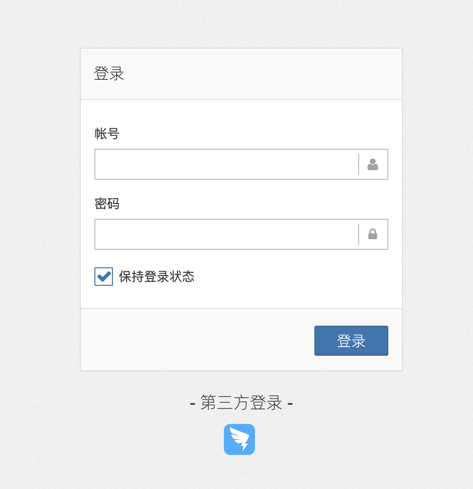
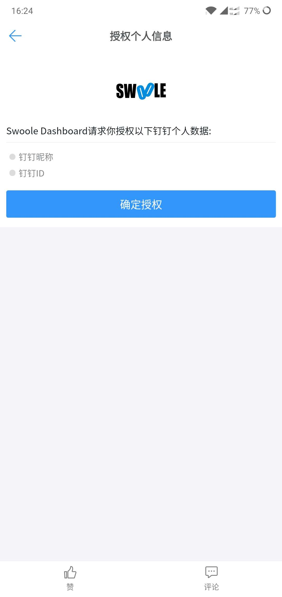

# 第三方登录
[TOC]
## 一、钉钉免登

服务端后台支持使用企业内部应用免登，PC端暂不支持E应用开发，所以使用微应用开发。
### 1. 创建应用

企业管理员登录[钉钉管理后台](https://oa.dingtalk.com/index.htm#/microApp/microAppList)，选择导航【工作台】，点击【自建应用】，创建自建应用，填写基本的信息。

开发模式选择“开发应用”，应用类型选择“微应用”。

链接填写对应的后台地址，比如[http://dashboard.demo.swoole-cloud.com](http://dashboard.demo.swoole-cloud.com/)

出口IP填写Admin后台的机器IP。

### 2. 获取配置参数

在创建应用后需要获取AppKey和AppSecret，这两个参数可以在应用的基础信息中获取到。

还需要一个CorpId，钉钉的企业id，在[钉钉开放平台首页](https://open-dev.dingtalk.com/#/index)可以获取到。

将这3个参数，填入后台的系统设置中。

### 3. 申请应用权限

需要申请获取手机号码和邮箱等个人信息，在钉钉开放平台后台->应用->接口权限申请开通即可。

### 4. 应用发布

测试功能可以正常使用后，就可以发布了，之后成员可在钉钉工作台上直接访问Dashboard后台。

## 二、钉钉扫码登录/钉钉移动端授权登录

> 此方法存在安全问题，如果后台外网可以直接访问，那么谁都可以登录查看信息

点击进入[钉钉开发者平台](https://open-dev.dingtalk.com/) 的页面，点击左侧菜单的【移动接入应用-登录】，然后点击右上角的【创建扫码登录应用授权】，创建用于扫码登录过程中验证身份的 `appId` 及 `appSecret` ，创建后即可看到 `appId` 和 `appSecret` 。

获取到 `appId` 和 `appSecret` 以后将其填入后台配置当中

之后登录就可以选钉钉扫码登录

在钉钉客户端（安卓或 `IOS` ）中打开后台系统，就自动切换为钉钉内免登第三方网站

第一次登录会获取授权

